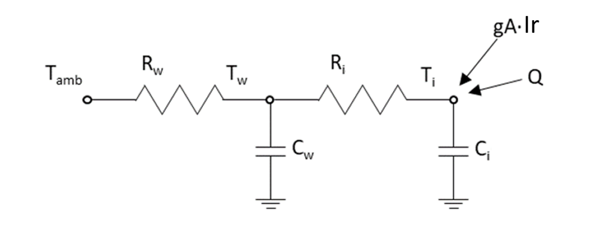

# CR_BCN_buildsim

Welcome to the **CR_BCN_buildsim** repository.

This repository contains scripts, models, and data workflows to simulate the thermal energy demand of approximately 37,000 residential buildings in Barcelona. The simulation engine is based on Reduced Order Grey Box Models (RC models) calibrated with white box TRNSYS simulations, allowing building-level predictions for heating, cooling, and total energy needs under different climate, geometry, and retrofit scenarios.

The required data is stored in the NextCloud repository, which is managed by our department at CIMNE.

---

## 👥 Authors

- Jose Manuel Broto - jmbroto@cimne.upc.edu
- Maria Teresa Sellart - tsellart@cimne.upc.edu
- Gerard Mor - gmor@cimne.upc.edu
- Aggelos Mylonas - amylonas@irec.cat
- Enric Mont Lecocq - emont@irec.cat
- Jordi Pascual - jpascual@irec.cat

---

## 🎯 Project Objectives

To simulate the final and primary energy consumption, CO₂ emissions, and economic costs associated with HVAC systems for all buildings under both:

- Base case (current conditions)
- Retrofitted and decarbonised scenarios

---

## 📁 Scripts Overview

### `generate_simulation_inputs.py`

Before running the simulations, the input dataset must be prepared using this script. It processes and enriches the cadastral and socio-economic data to match the input requirements of the CR_BCN_builsim engine. It performs the following steps:

- **Loads cadastral data** for Barcelona (from `hypercadastrer_ES`, see GitHub repository for more information ).
- **Transforms geometry and fields** to match the simulation engine format.
- **Assigns weather clusters** by linking each building to its nearest weather station using spatial joins.
- **Integrates INE social data** for Barcelona (from `social_ES`, see GitHub repository for more information )
- **Adds EPC-based features**,
- **Exports the final input dataset** to results/IREC_bcn_input.pkl

> This `.pkl` file is the **core input** used by the CR_BCN_builsim simulation engine. Make sure the path to the mounted NextCloud directory (`wd`) is correctly configured before running the script.

### `results_from_clusters_to_buildings.py`

This script matches the simulated results (which are generated for archetypal building clusters) to the actual building stock of Barcelona using their cadastral and geometric features.

This script is essential for transitioning from cluster-level simulation outputs to individual building-level energy demand estimates, enabling spatial analysis, retrofit targeting, and impact assessment at the city scale.

---

## 🏗️ Modelling Methodology

### White Box Simulations (TRNSYS)

Used to calibrate the reduced-order models. Based on:

- **3 building geometries:**
	- Multi-Family Isolated (MFI)
	- Multi-Family Non-Isolated (MFNI)
	- Single Family (SF)

- **17 original archetypes by construction period**
	- BA_1900_MFNI
	- BA_19011940_MFNI
	- BA_19011940_SF
	- BA_19411960_MFI
	- BA_19411960_MFNI
	- BA_19411980_SF
	- BA_19611980_MFI
	- BA_19611980_MFNI
	- BA_19812007_MFNI
	- BA_19812019_SF
	- BA_20082014_MFNI
	- BA_20152019_MFNI
	- BA_1900_MFI
	- BA_19011940_MFI
	- BA_19812007_MFI 
	- BA_20082014_MFI 
	- BA_20152025_MFI

Hourly resolution outputs from TRNSYS include:

- Indoor temperature (Ti)
- Wall temperature (Tw)
- Ambient temperature (Tamb)
- Filtered solar incident radiation (Ir)
- Internal gains/losses (Qin)
- Heating and cooling demands (Q)

---

### Grey Box Models (RC – Reduced Order)

Grey box models employ the **R2C2 state-space approach**, simulating thermal dynamics through a **lumped resistance and capacitance** electrical analogue. Figure 1 illustrates how an electric circuit comprising analogue resistances and capacitances simulates the thermal behaviour of buildings.

**Figure 1.** Building thermal dynamics assessed with a few parameters.

- Parameters are **calibrated vs. white box results**  
- Allows **fast, large-scale computation**  
- Models adapted where needed to match new building archetypes

---

## 📈 Simulation Parameters

Each building is defined by a unique combination of parameters stored in:

### `Base_case_archetypes_dict`

A dictionary containing 9 configuration fields:

**Table 1. Description of input parameters used to define each simulated building.**

| Key | Description |
|-----|-------------|
| `setpoint` | `"2226"` – Fixed temperature setpoints: Heating: 22 °C, Cooling: 26 °C |
| `archetype` | `"PeriodoConstructivo_MFI/MFNI/SF"` – Building archetype combining construction period (as defined in RETABIT) and typology: MFI, MFNI or SF = Single Family.|
| `climate_zone` | `"CL0"` to `"CL4"` – Weather clusters for Barcelona |
| `orientation` | One of 4 main cardinal directions (N, E, S, W), assigned based on each building’s predominant facade angle. |
| `street_width` | `"7"`, `"12"`, or `"20"` – Distance to opposite facade (in meters) |
| `user_behavior` | `"unaware"` – User behaviour assumes no active energy management. Only this behaviour is considered in this project. |
| `retrofitting_envelope` | `"no"` or `code from Table 3 –  Indicates the type of envelope renovation. Codes correspond to specific retrofit scenarios based on renovation year: buildings renovated 2008-2014 or >=2015 get a code, earlier renovations get `"no"`. |
| `retrofitting_hvac` | `"no"` or `"code from Table 4"` – HVAC retrofit applied only for renovations from 2015 onwards. |
| `energy_poverty` | `"no"` – Not considered in this project |

> **Note:** While the base case only uses the `"2226"` configuration (Heating: 22 °C, Cooling: 26 °C),  
> the simulation framework supports the following combinations of heating/cooling setpoints:

**Table 2. Supported heating and cooling setpoint combinations in the simulation engine.**

| Heating [°C] | Cooling [°C] |
|--------------|--------------|
| 15           | 30           |
| 19           | 29           |
| 20           | 28           |
| 21           | 27           |
| 22           | 26           |

### 🔁 Renovation Scenarios

Renovation measures are defined through two separate fields in the input dictionary: 

- retrofitting_envelope: controls envelope interventions
- retrofitting_hvac: controls HVAC system upgrades

**Table 3. Codes for envelope retrofitting levels.**

| Code | Envelope renovation components      |
|-------|----------------------------------------|
| `no`  | No retroffiting considered                          |
| `1`   | Windows                               |
| `2`   | Façade                                |
| `3`   | Façade + Windows                     |
| `4`   | Façade + Windows + Roof              |
| `5`   | Façade + Windows + Roof + Heat pump |

**Table 4. HVAC upgrade options.**
| Code |HVAC renovation      |
|-------|----------------------------------------|
| `no`  | No HVAC changes                          |
| `heatpump` | Heat pump only                    |

---

## 📊 Output Data

The results are saved in two aggregated files that contain data for **all simulated buildings**:

### `Building_energy_demand_yearly`

- Heating demand [kWh/m²/year]  
- Cooling demand [kWh/m²/year]  
- Domestic Hot Water (DHW) [kWh/m²/year]  
- Lighting and appliances [kWh/m²/year]  

> All values are normalised per square meter.

---

### `Kpis_yearly`

A complete set of **Key Performance Indicators** (KPIs). Includes:

- Final energy by vector  
- Primary energy  
- CO₂ emissions  
- Energy cost per use  
- Total energy cost  

> KPIs related to **biomass** are always set to `0`, as **biomass is not considered** in the Barcelona context.

### `Mapping results to real buildings`

The simulation results in `building_energy_demand_yearly` and `kpis_yearly` are produced for each unique combination of input parameters (building archetype, climate zone, setpoint, retrofit status, etc.). These combinations define simulation clusters, not individual buildings. To assign these results to actual buildings in Barcelona, the script `results_from_clusters_to_buildings.py` matches each building in the cadastral dataset to the corresponding simulation cluster using its attributes (e.g. construction year, typology, orientation, etc.). It then assigns the simulation results to that building. 

---

## 📜 License

This project is licensed under the **European Union Public License (EUPL), Version 1.2**.  
You may obtain a copy of the license at:

[https://joinup.ec.europa.eu/collection/eupl/eupl-text-eupl-12](https://joinup.ec.europa.eu/collection/eupl/eupl-text-eupl-12)

Unless required by applicable law or agreed to in writing, software distributed under this license is distributed **on an "AS IS" basis**, without warranties or conditions of any kind.

©  2024 Maria Teresa Sellart, Jose Manuel Broto, Gerard Mor

---

Thank you for using **CR_BCN_buildsim**!  
For any questions or suggestions, feel free to reach gmor@cimne.upc.edu
